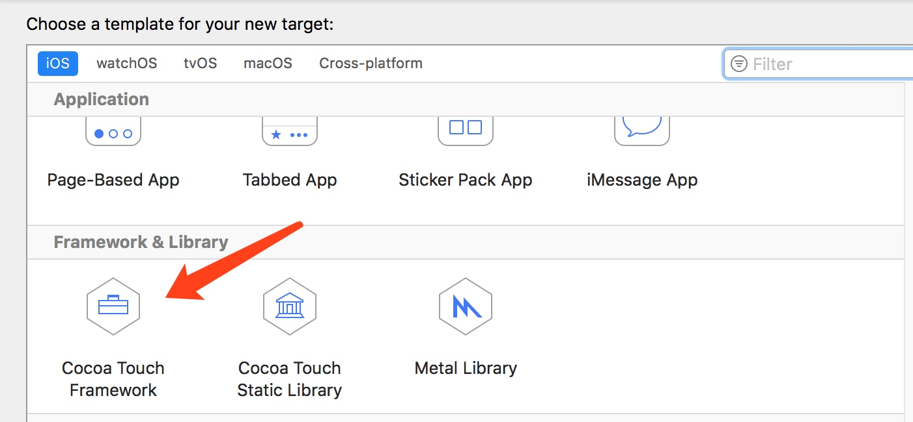
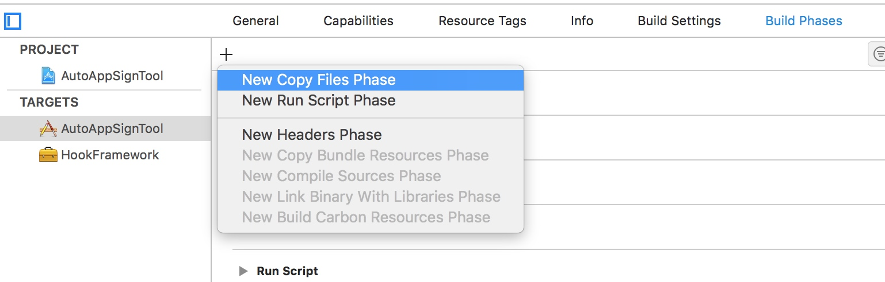
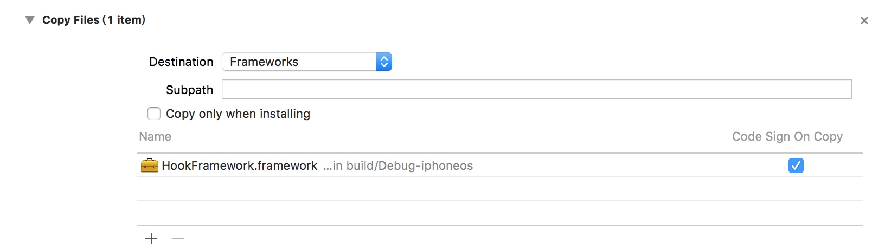
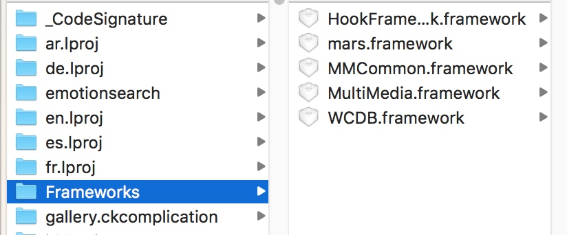
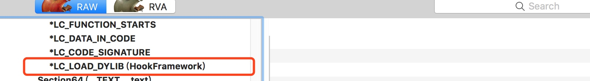
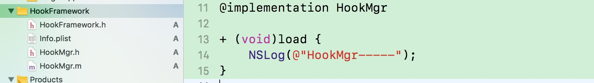

# iOS App MachO注入 - `Framework`注入

## Framework注入

### 1. 新建`TARGETS`




### 2. 添加依赖关系

- 在`Buildd Phases`选择`New Copy Files Phase`新建依赖库文件，选择`Destination`为`Framework`。添加刚刚新建的frammework库





- 验证`frammewor`注入库添加依赖是否成功
编译程序，打开`Products`下app文件，包内容下`Frameworks`文件下已生成对应注入库



### 3. 修改MachO文件的Load Commands（将`frammewor`库注入到可执行文件中）

- 使用`yololib`工具注入（手动）

```
$ yololib WeChact Frameworks/HookFramework.framework/HookFramework
```


- 使用`yololib`工具注入（脚本）

```
# 需要注入的动态库的路径(写死了)
INJECT_FRAMEWORK_RELATIVE_PATH="Frameworks/HookFramework.framework/HookFramework"

## 通过工具实现注入
"/${SRCROOT}"/yololib "$TARGET_APP_PATH/$APP_BINARY" "$INJECT_FRAMEWORK_RELATIVE_PATH"
```

- 使用`MachOView`工具查看是否注入成功



### 4. 注入代码
在`HookFramework`库下创文件，实现`load`方法，利用`Method Swizzle`实现修改



